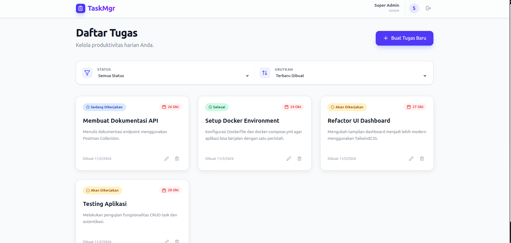
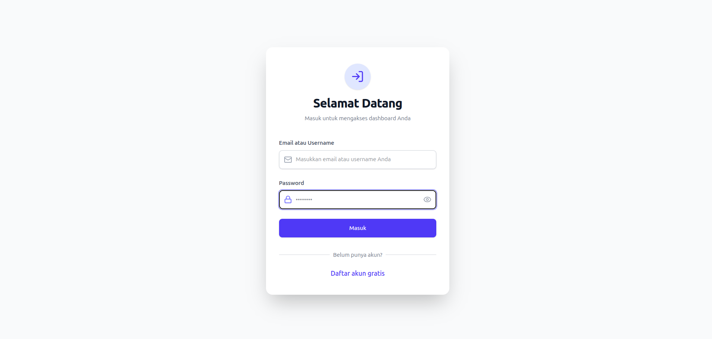
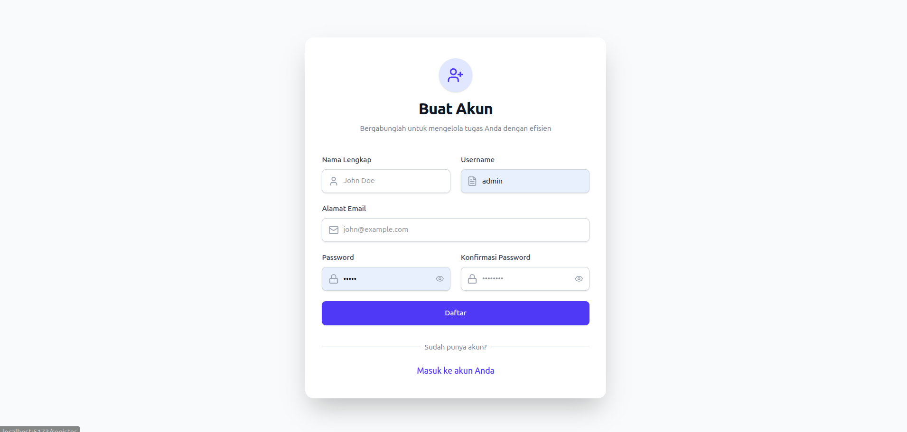
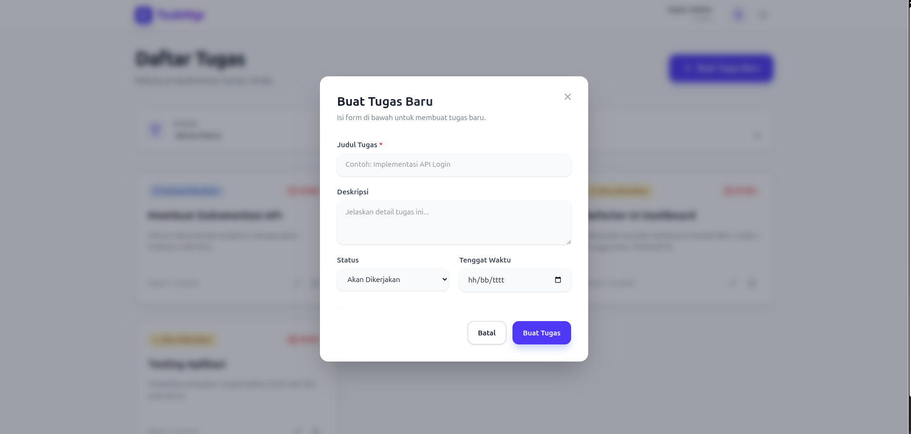
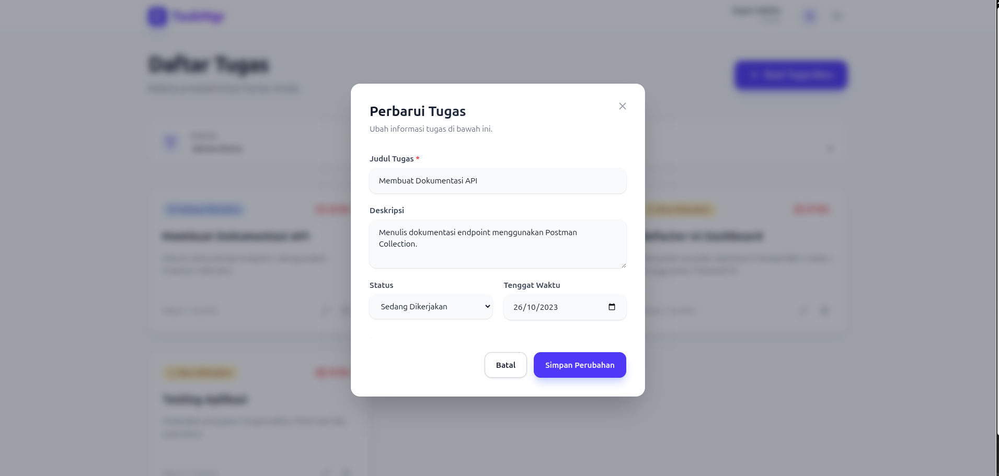
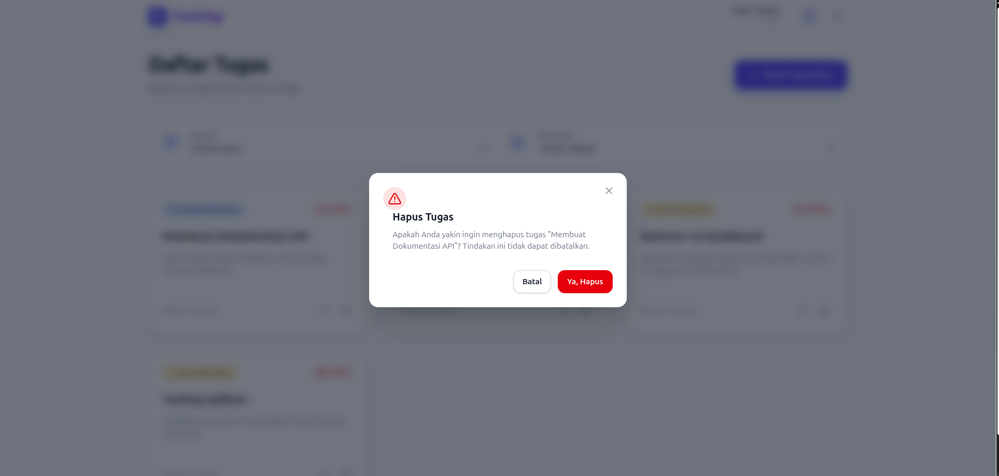

# Task Management System

Aplikasi Fullstack Task Management System yang dibangun sebagai bagian dari proses technical assessment. Aplikasi ini membantu pengguna mengelola tugas harian dengan fitur CRUD, filter, sorting, dan UI modern.



## 🚀 Fitur Utama

- **Autentikasi Pengguna**: Login & Register aman dengan JWT dan Bcrypt.
- **Manajemen Tugas**: Create, Read, Update, Delete (CRUD) tugas.
- **Filter & Sorting**: Filter berdasarkan status (To Do, In Progress, Done) dan urutkan berdasarkan deadline.
- **UI Modern**: Desain responsif menggunakan TailwindCSS dengan sentuhan Glassmorphism.
- **Feedback Interaktif**: Notifikasi Toast dan Modal konfirmasi kustom.

## 🛠️ Teknologi yang Digunakan

### Backend

- **Framework**: Laravel 12
- **Language**: PHP 8.2+
- **Auth**: JWT-Auth (`php-open-source-saver/jwt-auth`)
- **Database**: MySQL

### Frontend

- **Framework**: React.js (Vite)
- **Styling**: TailwindCSS v4
- **Icons**: Lucide React
- **HTTP Client**: Axios

## 📦 Langkah Menjalankan Aplikasi

### Opsi 1: Menggunakan Docker (Recommended)

Pastikan Docker dan Docker Compose sudah terinstall.

1. Jalankan perintah berikut di root project:
   ```bash
   docker-compose up --build
   ```
2. Aplikasi Frontend dapat diakses di: [http://localhost:5173](http://localhost:5173)
3. Aplikasi Backend berjalan di: [http://localhost:8000](http://localhost:8000)

_Catatan: Jika backend error saat pertama kali jalan, jalankan migrasi manual:_

```bash
docker-compose exec backend php artisan migrate --seed
```

### Opsi 2: Menjalankan Manual

#### Backend Setup

1. Masuk ke folder backend: `cd backend`
2. Install dependencies: `composer install`
3. Setup environment:
   ```bash
   cp .env.example .env
   # Edit .env sesuaikan DB_DATABASE=task_management_system, DB_USERNAME, DB_PASSWORD
   ```
4. Generate Key & JWT Secret:
   ```bash
   php artisan key:generate
   php artisan jwt:secret
   ```
5. Jalankan Migrasi & Seeder:
   ```bash
   php artisan migrate --seed
   ```
6. Jalankan Server: `php artisan serve`

#### Frontend Setup

1. Masuk ke folder frontend: `cd frontend`
2. Install dependencies: `npm install`
3. Jalankan development server: `npm run dev`

## 👤 Informasi Login Dummy

Gunakan akun berikut untuk login (Data dari DatabaseSeeder):

- **Username**: `admin`
- **Email**: `admin@gmail.com`
- **Password**: `dsadsadsa`

## 🗄️ Struktur Database

Database schema dapat dilihat di file `db.sql` atau melalui migrasi Laravel. Tabel utama:

- **users**: Menyimpan data pengguna.
- **tasks**: Menyimpan data tugas (judul, deskripsi, status, deadline).

## 📸 Screenshots

| Login                           | Dashboard                               |
| ------------------------------- | --------------------------------------- |
|  |  |

| Register                              | Create Task                       |
| ------------------------------------- | --------------------------------- |
|  |  |

| Edit Task                     | Delete Confirmation               |
| ----------------------------- | --------------------------------- |
|  |  |

---

**Author**: Azarya Geraldo
